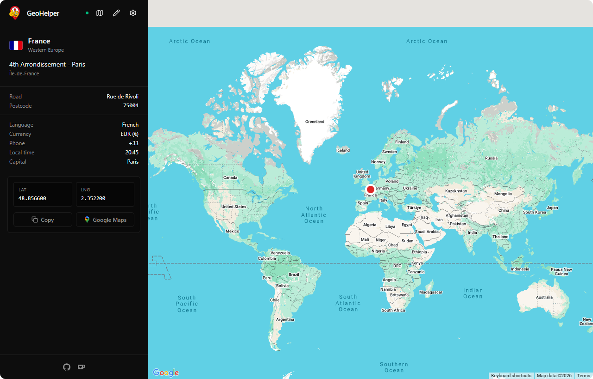
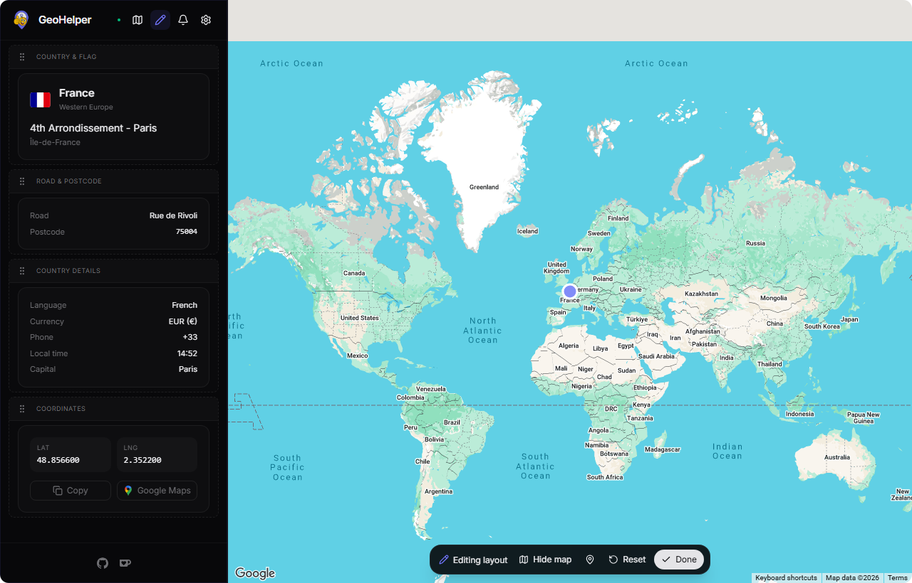

<div align="center">
  

  <h1>GeoHelper</h1>

  <p><strong>A clean, lightweight GeoGuessr companion for Steam</strong></p>
  <p>Live coordinates · Country · Region · Road · Postcode · Flag · Map preview</p>

  <p>
    <a href="../../stargazers"></a>
    <a href="../../releases/latest"></a>
    <a href="../../releases"></a>
    
    <a href="https://ko-fi.com/wiktorekdev"></a>
    <a href="LICENSE"></a>
  </p>
</div>

<p align="center">
  
</p>

## What is GeoHelper?

GeoHelper is a desktop companion for **GeoGuessr on Steam**. While you play, it shows live round information in a clean sidebar: coordinates, country, region, road, postcode, flag, and a map preview.

Built for **custom maps, singleplayer, solo practice, and learning geography**.

## Highlights

- **Live round data** — coordinates and rich location details, updated as you play
- **Fully customizable layout** — drag & drop widgets, per-text fonts/sizes/colors, custom marker styling
- **Map preview** — OpenStreetMap out of the box, optional Google Maps with your own API key
- **Tiny footprint** — ~6 MB app built with Tauri
- **Non-invasive** — no injection, no DLLs, no browser extensions; it reads Steam's own Chrome DevTools Protocol

## How it works

GeoHelper connects to the Chrome DevTools Protocol endpoint that Steam exposes (`--remote-debugging-port=34788 --remote-allow-origins=*`) and listens to the game's own network RPC traffic. Everything is processed locally on your machine — nothing is sent anywhere.

## Getting started

1. Download the latest release from [Releases](../../releases/latest)
2. In Steam, right-click **GeoGuessr** → **Properties** → **Launch Options** and add:
   ```
   --remote-debugging-port=34788 --remote-allow-origins=*
   ```
3. Launch GeoHelper and start playing

**Supported platforms:** Windows 10/11 · Linux · macOS 11+

### Linux notes

The `.deb` package installs its WebKitGTK dependencies automatically. On Arch-based distros (Arch, CachyOS), use the included package recipe:

```bash
git clone https://github.com/wiktorekdev/geohelper.git
cd geohelper/packaging/arch
makepkg -si
```

Running the AppImage or raw binary directly? Install the runtime dependencies manually:

```bash
sudo pacman -S --needed webkit2gtk-4.1 libsoup3 gtk3 libayatana-appindicator
```

Building from source on Arch requires the full Tauri development set:

```bash
sudo pacman -S --needed webkit2gtk-4.1 base-devel curl wget file openssl appmenu-gtk-module libappindicator-gtk3 librsvg xdotool
```

## Customization

Click the pencil icon in the sidebar to enter **Edit Mode**:

- Drag & drop to reorder widgets
- Style any text — 20 bundled fonts, size, bold/italic/underline, custom colors
- Customize the map marker (fill, border, size)
- Resize the sidebar, hide the map, switch light/dark theme

<p align="center">
  
</p>

## Map providers

| Feature      | OpenStreetMap (default) | Google Maps (optional)   |
| ------------ | ----------------------- | ------------------------ |
| Availability | Built-in                | Requires API key         |
| Pricing      | Completely free         | Google Cloud free tier   |
| Styles       | Multiple CartoDB styles | Roadmap, Satellite, Dark |

## Build from source

```bash
bun install
bun run dev          # development with hot reload
bun run build        # create release builds
bun run test         # frontend unit tests
bun run check        # lint, tests, and frontend build
```

## Support

If you enjoy GeoHelper and want to support development:

<a href="https://ko-fi.com/wiktorekdev">
  
</a>

## Disclaimer

GeoHelper is a **personal, educational practice tool**. Using helpers in ranked or competitive modes violates GeoGuessr's Terms of Service and may result in a ban. Use responsibly.

## License

[MIT](LICENSE)
