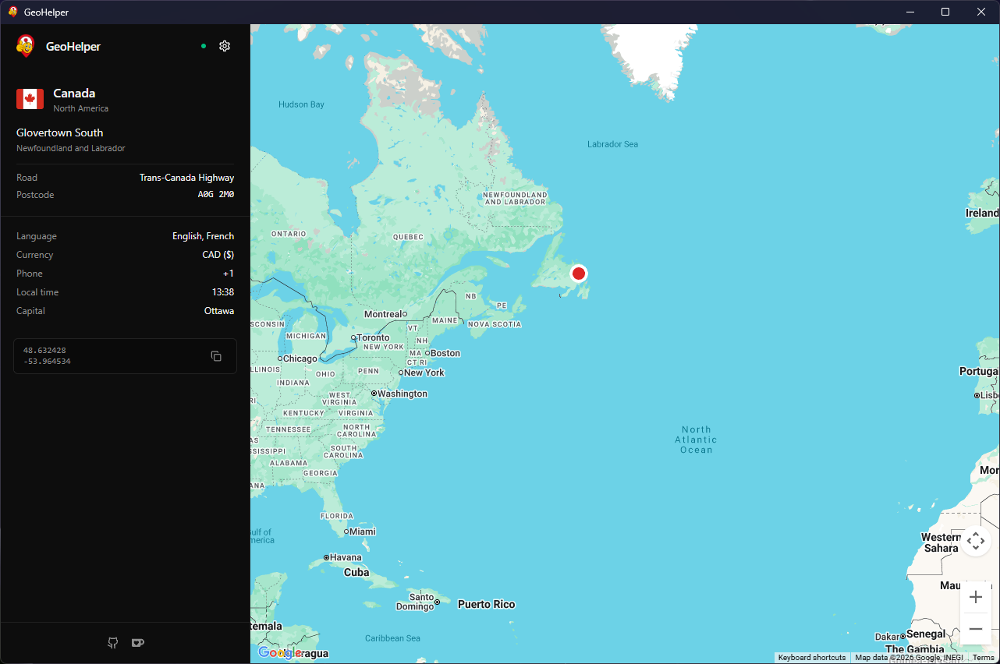

<div align="center">
  

  <h1>GeoHelper</h1>
  <p>A tiny helper window that shows real coordinates while you play GeoGuessr on Steam.</p>

  <p>
    
    
    
    
    <a href="LICENSE"></a>
  </p>
</div>

<p align="center">
  
</p>

## What this is

GeoHelper is a small Windows app (~6 MB) that sits next to GeoGuessr and tells you where the current Street View pano actually is. It works by reading the Chrome DevTools traffic the game already makes. No browser extension, no injected scripts, no automation inside the game.

It's meant for custom maps, solo play and learning. Don't use it in ranked matches.

## Getting started

1. Download `GeoHelper.exe` from [Releases](../../releases) and put it anywhere.
2. In Steam, right-click **GeoGuessr**, **Properties**, **Launch Options**, and paste:
   ```
   --remote-debugging-port=9222 --remote-allow-origins=*
   ```
3. Start GeoGuessr. Start GeoHelper. The dot next to the logo goes green once they see each other.

That's it. Start a round, the coordinates show up.

## System requirements

- Windows 10 or 11

## Build from source

```bash
git clone https://github.com/wiktorekdev/geohelper.git
cd geohelper
npm install
npm run dev       # hot-reload dev
npm run build     # release build -> src-tauri/target/release/geohelper.exe
```

You need Node 20+ and a stable Rust toolchain. First build pulls around 300 MB of crates, later ones are incremental.

Useful scripts:

```bash
npm run vite:build                                    # type-check + frontend build only
cargo check --manifest-path src-tauri/Cargo.toml      # Rust only
node scripts/sniffer.cjs                              # dump GeoGuessr CDP traffic to a .log file
```

## Website

The public website lives in `site/` and is deployed by `.github/workflows/pages.yml` to GitHub Pages.

```bash
cd site
npm install
npm run build
```

The workflow builds with `BASE_URL=/geohelper/`, which matches the default Vite base path for `wiktorekdev.github.io/geohelper`. Set `BASE_URL=/` when deploying the same site to a custom domain.

## How it works, roughly

GeoHelper connects to `localhost:9222`, the CDP endpoint GeoGuessr exposes when you pass those launch flags. It watches network traffic coming out of the game, picks up Street View pano IDs from Google Maps RPC responses, and asks the game's own `StreetViewService` to turn them back into coordinates. The result goes through the Tauri bridge into the React UI.

No servers, no external APIs beyond the ones the map and reverse-geocoder already need.

## Roadmap

- [ ] App overlay mode
- [ ] Chromium / Gecko browser extension
- [ ] Layout customizer
- [ ] Linux and macOS builds

If any of this matters to you, open an issue. Helps prioritise.

## Contributing

PRs welcome. Keep diffs focused and run the two build checks above before opening. Bigger stuff, open an issue first so we can sync on direction.

## Support

If this is useful to you: [ko-fi.com/wiktorekdev](https://ko-fi.com/wiktorekdev)

## Disclaimer

This is a personal, educational project. Read [GeoGuessr's ToS](https://www.geoguessr.com/terms) before using it. Using helpers in ranked or online modes can get your account banned. Stick to custom maps and solo play.

## License

[MIT](LICENSE).
